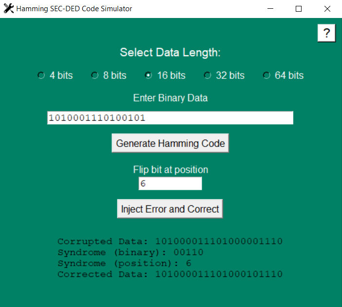

<h1 align="center">Hamming SEC-DED Simulator</h1>

<p align="center">
Desktop-based Hamming SEC-DED encoding and error correction simulator built with Python and Tkinter.
</p>

<p align="center">
  
  
  
  
  
</p>

---

## Overview

Hamming codes are widely used in:

- Digital communication systems
- ECC memory systems
- Network transmission
- Fault-tolerant computing

This simulator demonstrates the complete workflow:

1. Binary data input
2. Hamming code generation
3. Bit-flip error injection
4. Syndrome calculation
5. Error localization
6. Automatic correction

---

## Project Structure

```text
Hamming_SEC-DED_Simulator/
│── .gitattributes
│── .gitignore
│── assets/
│   │── icons/
│   │   └── settings.ico
│   └── screenshots/
│       └── application-screenshot.png
│── hamming_sec_ded.py
│── LICENSE
│── README.md
```

---

## Features

- Supports binary input lengths:
  - `4-bit`
  - `8-bit`
  - `16-bit`
  - `32-bit`
  - `64-bit`

- Generates Hamming encoded output with parity bits
- Simulates transmission errors by flipping a selected bit
- Detects errors using syndrome analysis
- Automatically corrects single-bit errors
- Displays syndrome in both **binary** and **decimal**
- Built with an interactive **Tkinter GUI**
- Includes built-in **Help** support
- Logs all encoding and correction operations into `hamming_log.txt`

---

## Screenshot



---

## Demo Video

Watch the demo on YouTube:  
https://www.youtube.com/watch?v=rHKQKSCRnW0

---

## How to Run

Clone the repository:

```bash
git clone https://github.com/AFurkanOcel/Hamming_SEC-DED_Simulator.git
cd Hamming_SEC-DED_Simulator
```

Run the application:

```bash
python hamming_sec_ded.py
```

Requirements:

```text
Python 3.x
```

No external libraries are required.

---

## Example Workflow

Input:

```text
10110011
```

Generated Hamming Code:

```text
001101100011
```

Inject Error at Bit Position:

```text
5
```

Detected Syndrome:

```text
5
```

Corrected Output:

```text
001101100011
```

---

## Technical Details

Core algorithm components:

- Dynamic parity bit calculation
- Hamming code generation
- Syndrome-based error detection
- Bit-flip based correction logic
- GUI interaction with Tkinter

---

## Educational Purpose

This project was developed to demonstrate the practical implementation of **Hamming error-correcting codes** and to visualize how modern computing systems detect and correct transmission errors.

---

## Future Improvements

- Random multi-bit error simulation
- Step-by-step parity visualization
- Export results to file
- Web-based implementation

---

## Author

**A. Furkan ÖCEL**  

---

## License

This project is licensed under the terms included in the repository's `LICENSE` file.
